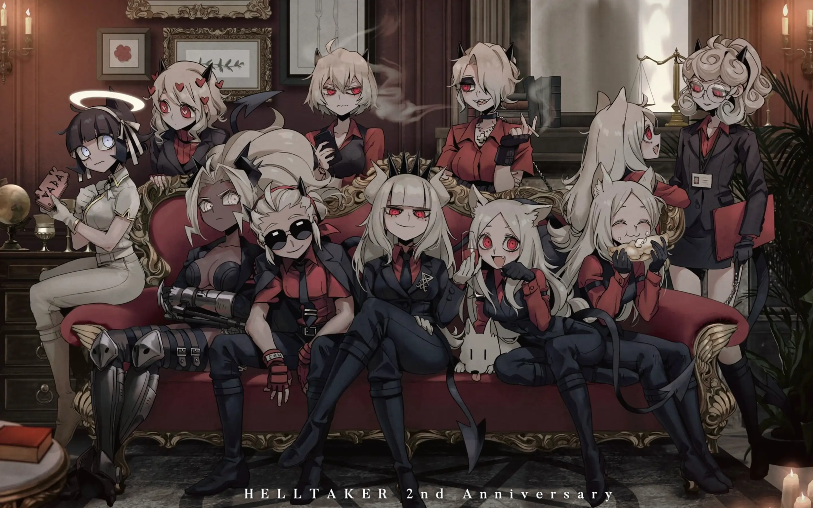

Sometimes the best things come in small packages.

Helltaker is a short, free puzzle game that absolutely nails its aesthetic. Everything from the sharp suit demons to the crunchy pixel art feels intentional and confident.

What I love most is how it doesn't overstay its welcome. It knows exactly what it is, delivers that experience perfectly, and gets out. No filler, no bloat, just pure focused design.

**The lesson:** Know your vision, execute it with care, and don't be afraid to keep it tight.