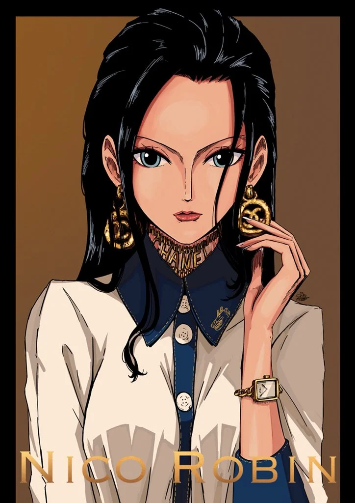
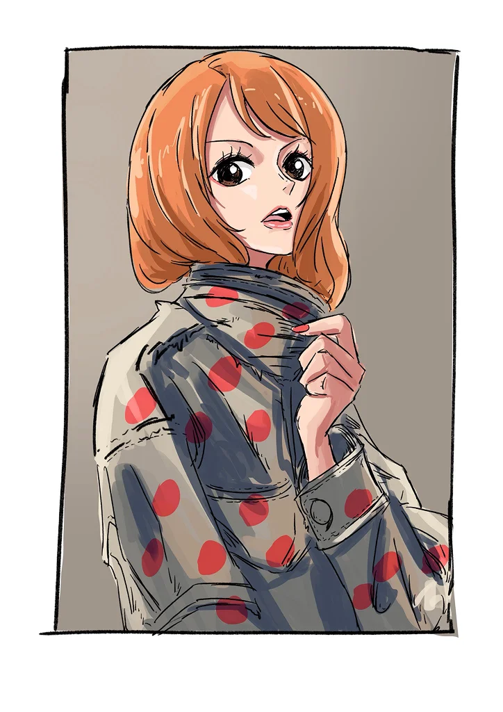
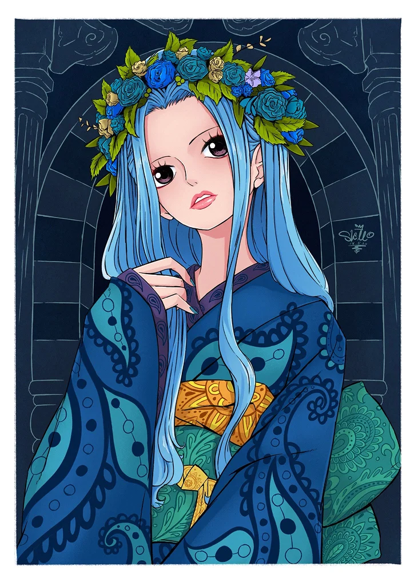
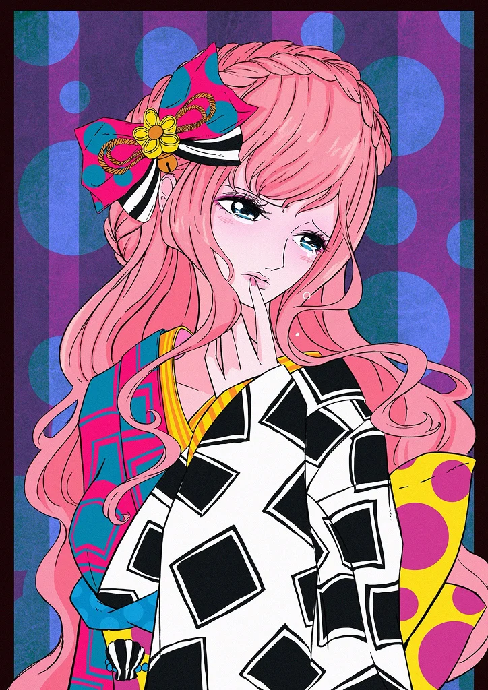
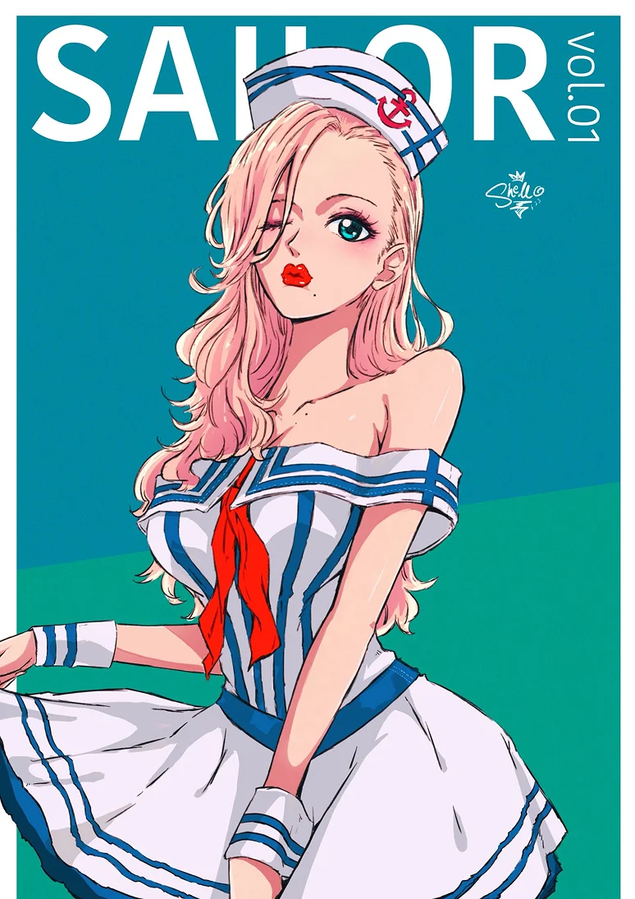
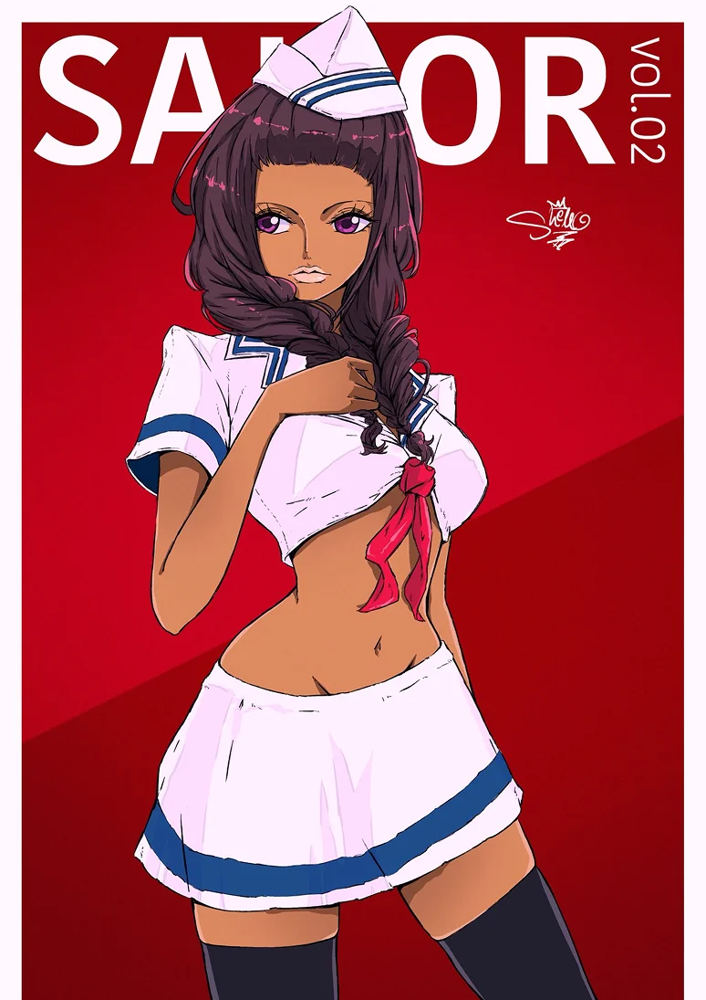
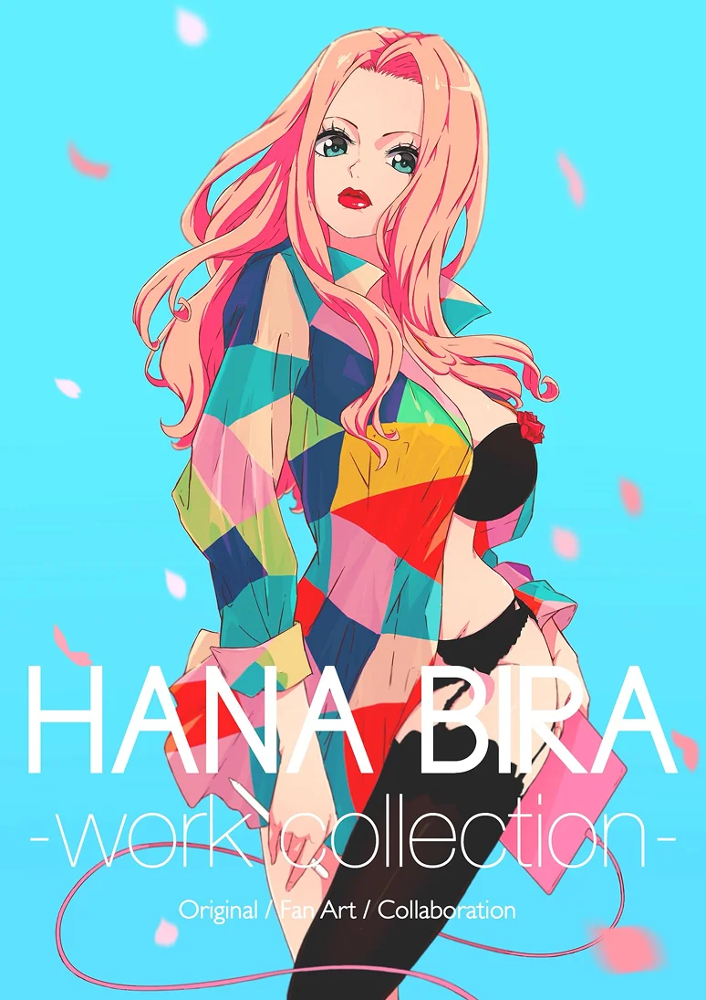
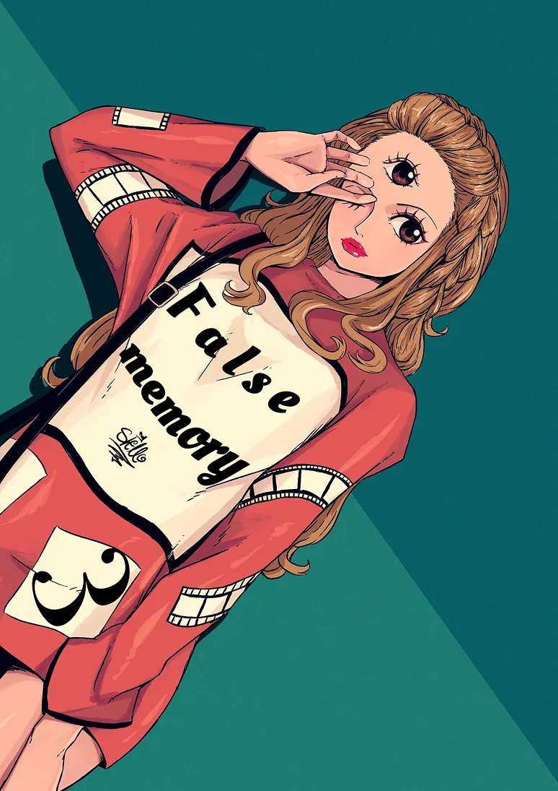

# Ringadindons

A visual exploration of character design and whimsical storytelling through vibrant illustrations.

---

## The Collection

A playful introduction to the world of Ringadindons, where each character brings their own unique personality and charm.

### Character Development

The design process focused on creating memorable silhouettes and expressive details that bring each character to life.

### Visual Language

Each illustration maintains a consistent visual language while allowing individual character personalities to shine through bold colors and dynamic poses.

### Evolution

The series shows the evolution of the visual style, experimenting with composition, color palettes, and character interactions.

---

**Year:** 2025
**Category:** Concept Art
**Medium:** Digital Illustration
